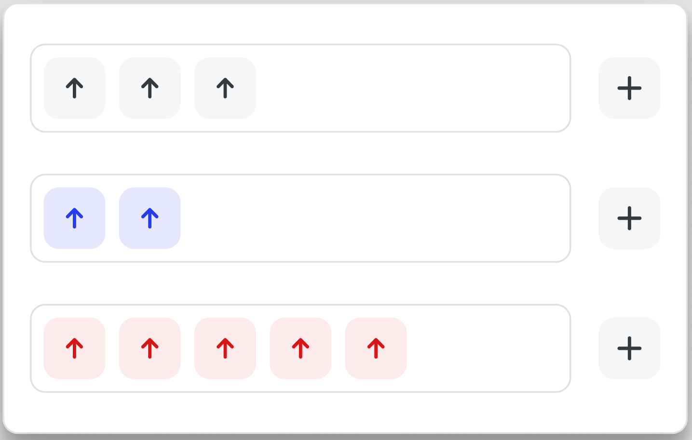

# Vue 3 JS Technical Project v1

This is essentially a fresh install of Vue 3 + Vite, ESLint, Prettier, TailwindCSS, Vue Router, Vuex

## Getting started

1. Go to project folder and install dependencies:

```sh
yarn
```

2. Launch development server, and open `localhost:3000` in your browser:

```sh
yarn dev
```

## Instructions

1. Start a new Vue 3 Project following this guide: https://learnvue.co/2020/12/setting-up-your-first-vue3-project-vue-3-0-release/#vite

- You must use Vue 3 and Vite

2. Install the Vuex-Store: https://vuex.vuejs.org/installation.html

3. Create an Upvote Component with the following properties:

- It has two states, normal (not filled in) and selected (filled in)
- You click on the component to switch between one state and the next
- The state for a component will update all components which are linked to it.
  The “reactivity” of each Upvote’s state must utilize the Vuex-Store
- NOTE: There should only be 1 component for the Upvote

4. Create the wireframe shown below

- The + buttons beside the black rectangles will create a new Upvote component within the adjacent black rectangle, and that Upvote component is linked to the same state as the other components.
- The colour of the Upvote components is only a visual representation of their shared state. Your final product should not have multiple colours, only the selected and non-selected states.


